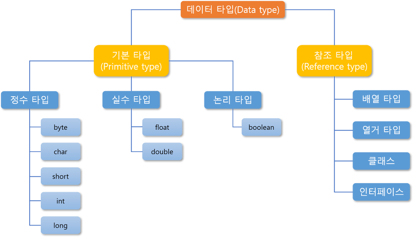

# This-is-Java
1. [Settings](https://github.com/abarthdew/this-is-Java/blob/main/basics/This-is-Java1.md)   
2. [Data Type Basic](https://github.com/abarthdew/this-is-Java/blob/main/basics/This-is-Java2.md)   
   
3. [Operator](https://github.com/abarthdew/this-is-Java/blob/main/basics/This-is-Java3.md)   
4. [Condition Statement](https://github.com/abarthdew/this-is-Java/blob/main/basics/This-is-Java4.md)   
5. [Data Type Advance](https://github.com/abarthdew/this-is-Java/blob/main/basics/This-is-Java5.md)   
6. [Object](https://github.com/abarthdew/this-is-Java/blob/main/basics/This-is-Java6.md)   