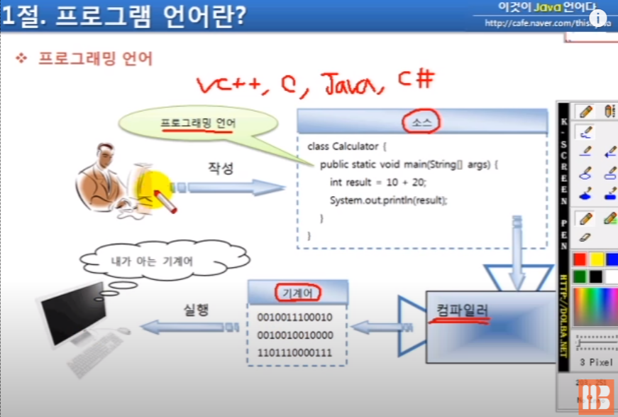

## 목차
[1.1 프로그래밍 언어란?](#11-프로그래밍-언어란)   
[1.2 자바란?](#12-자바란)   
[1.3 자바 개발 환경 구축](#13-자바-개발-환경-구축)   
[1.4 자바 프로그램 개발 순서](#14-자바-프로그램-개발-순서)   

## 1.1 프로그래밍 언어란?



- 프로그래밍 언어 : 소스파일(txt)을 작성할 때 사용되는 언어
    - C++, JAVA, VC++ 등
- 개발자가 소스파일을 만들고 → 이 소스파일을 컴파일러가 컴퓨터가 이해할 수 있는 언어로 변환 → 컴퓨터 운영체제(windows, Linux)에서 언어를 해석해서 실행

## 1.2 자바란?

.png)

- Java 언어로 개발된 프로그램은 다른 운영체제 환경에서 쉽게 실행할 수 있다.
- 자바 소스 코드 파일 작성(.java) → 컴파일 → 클래스 파일(.class)로 변환됨 → 이 파일을 여러 운영체제 환경에서 실행 가능

.png)

- 클래스: 객체를 만들기 위한 설계도. 자바는 항상 클래스부터 만들고 시작. 때문에, 다른 언어들보다 더 완벽한 객체지향적 성격을 가지고 있음.
- 자동차의 예: 여러 자동차 부품을 먼저 만들고, 그 부품들을 조립해서 완성된 자동차를 만드는 것.

.png)

- 함수적 스타일 코딩 지원: Java8 부터 가능
- 메모리 자동 관리: 가비지 컬렉터
- 콘솔 프로그램: 명령 기반 등 다양한 프로그램 개발 가능
    
    ⇒ 이를 위해서는 다양한 라이브러리, 즉 개발도구와 API를 제공
    
- Java SE: 자바 프로그램을 실행하기 위한 최소한의 JVM 실행환경, 이를 사용하기 위해서 JDK라는 형태로 구현체 제공
- Java EE: WAS 설치 후, 웹 애플리케이션 개발 및 실행 가능

.png)

- 병렬 처리를 위해서는 멀티 스레드가 필요함
- 프로그램 실행 도중 클래스를 메모리에 로딩해서 사용

## 1.3 자바 개발 환경 구축

.png)

- Java SE: JVM, 자바 프로그래밍이 가장 공통적으로 사용하는 API를 묶어놓은 클래스
- JDK, JRE: SE를 가지고 실제 사용할 수 있도록 만들어진 구현체
- 개발할 때는 개발 도구인 JDK 필수, JRE는 자바 프로그래밍 실행을 위한 소프트웨어
- 즉, 컴파일이 필요한 프로그램은 JDK, 다른 사람이 만들어 놓은 프로그램을 실행만 할 때는 JRE만 있어도 됨

.png)

- Java 8 Update 5 : JRE
- Java SE Development kit 8 Update 5 : JDK

.png)

- 그러므로, Java 8 Update 5를 지우면 위 사진의 jre8 폴더가 삭제됨
- 해당 폴더는 브라우저에서 돌아가는 자바 프로그램인 애플릿을 서버에서 다운로드 해서 실행할 때 사용됨

.png)

- jdk1.8.0_05 폴더 안에도 jre 폴더가 있기 때문에 /java/jre8 폴더는 삭제해도 무방
- 환경변수: 운영체제 콘솔에서 실행할 수 있게 하기 위해 JDK의 경로를 알려줌

.png)

- javac.exe: 컴파일을 위해 필요한 명령어
- java.exe: 자바 프로그램을 실행하기 위해 필요한 명령어
- 해당 명령어들을 콘솔에서 사용하려면 환경변수에 경로를 추가해 줘야 함

## 1.4 자바 프로그램 개발 순서

.png)

- “hello”를 출력하는 프로그램을 만들고자 할 때
    
    → Hello.java 라는 소스파일을 자바 언어로 작성해서 생성해야 함
    
    → 컴파일러를 통해 컴파일: JDK가 제공해주는 javac.exe로 컴파일
    
    ```jsx
    $ javac Hello.java
    ```
    
    Hello.class라는 바이트 코드 파일이 생성이 됨
    
    → 클래스 파일을 해석: JVM 구동 명령어 java.exe로 클래스 파일 찾기 및 실행
    
    ```jsx
    $ java(.exe 생략 가능) Hello (.class 확장명 생략 가능)
    $ java Hello
    ```
    
    → 자바 구동 명령어가 Hello.class를 찾아 완전한 기계어로 번역한 뒤 실행
    

.png)

- windows와 Mac에 서로의 운영체제에 종속적인 JVM이 설치되어 있다면?
    
    ⇒ byte 코드 파일은 어떠한 JVM에서도 공통적으로 해석될 수 있는 파일이기 때문에, 운영체제 종류나 JVM 버전과 관계없이 실행 가능.
    
    ⇒ 개발은 windows에서 하고, 실행은 Mac에서 해도 무방.
    
    ⇒ 이와 달리, VC++ 등은 windows에서만 개발, 실행이 가능. 즉, 운영체제에 종속됨.
    

.png)

- 프로그램 작성해 보기[📁hello]
    
    .png)
    
    ⇒ Hello.java
    
    ```jsx
    class Hello {
      public static void main(String ar[]) {
        System.out.println("Hello!");
      }
    }
    ```
    
    → Hello.class
    
    ```jsx
    C:\Users\auswo\Downloads\PortableGit\this-is-Java\hello>javac Hello.java
    
    C:\Users\auswo\Downloads\PortableGit\this-is-Java\hello>dir
     C 드라이브의 볼륨에는 이름이 없습니다.
     볼륨 일련 번호: CEC7-4056
    
     C:\Users\auswo\Downloads\PortableGit\this-is-Java\hello 디렉터리
    
    2022-08-31  오후 10:17    <DIR>          .
    2022-08-31  오후 10:17    <DIR>          ..
    2022-08-31  오후 10:17               410 Hello.class
    2022-08-31  오후 10:09                98 Hello.java
                   2개 파일                 508 바이트
                   2개 디렉터리  181,445,763,072 바이트 남음
    ```
    
    → 실행(JVM이 main()메소드 부터 실행함)
    
    ```jsx
    C:\Users\auswo\Downloads\PortableGit\this-is-Java\hello>java Hello
    Hello!
    ```