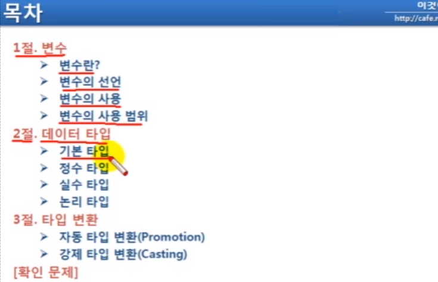

## 목차
[2.1 변수(1)](#21-변수1)   
[2.1 변수(2)](#21-변수2)   
[2.2 데이터 타입(1)](#22-데이터-타입1)   
[2.2 데이터 타입(2)](#22-데이터-타입2)   

## **2.1 변수(1)**

.png)

.png)

- =은 ‘같다’의 뜻이 아닌, value 변수에 30을 저장한다는 뜻

## **2.1 변수(2)**

.png)

.png)

- [캐리지 리턴(CR)과 라인 피드(LF)란?](https://jw910911.tistory.com/90)

.png)

.png)

.png)

.png)

- 변수는 자신이 선언된 블록 내에서만 사용이 가능
- 블록이란? {}로 감싸진 구역
- 메소드 블록: 메소드를 선언할 때 작성하는 {} 내 구역
- if문에 대한 실행 블록, for문에 대한 실행 블록 등
- var1은 main, if, for문 내에서 사용이 가능하지만, var2는 if 블록에서만, var3는 for 블록에서만 사용 가능

## **2.2 데이터 타입(1)**

.png)

- 변수가 한 번 선언되면, 타입을 바꿀 수 없음
- s: 최상위 비트에 양수/음수를 구분짓는 MSB가 위치
- float, double: MSB, 가수, 지수로 구성

.png)

- 여기서 최상위 비트는 양수(0)/음수(1)를 구분지음
- 변수 자체에 초과값을 저장하면 컴파일 에러가 나지만, b++, b—와 같이 실행 중에 값의 범위를 초과한 경우 순회하여 초기값으로 돌아감

.png)

- 유니코드를 알고 싶을 경우: 선언된 char 타입 변수를 int에 선언해 줌
- char 타입에는 하나의 ‘문자’만 저장 가능, ‘문자열’을 저장하지 못함
- 공백은 유니코드 32에 존재하는 값이므로 char 타입에 저장 가능

## **2.2 데이터 타입(2)**
https://www.youtube.com/watch?v=gzUz-SaTZuY&list=PLVsNizTWUw7FPokuK8Cmlt72DQEt7hKZu&index=12