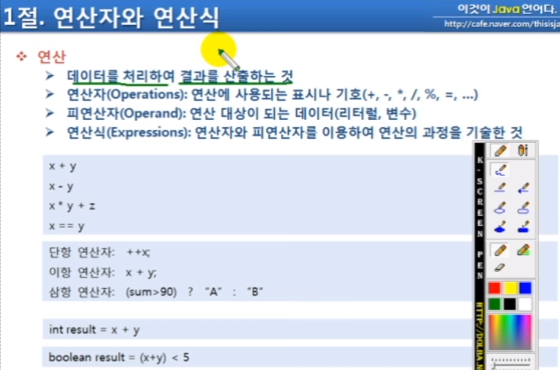

## 목차
[3.1 연산자와 연산식](#31-연산자와-연산식)   
[3.2 연산의 방향과 우선 순위](#32-연산의-방향과-우선-순위)   
[3.3 단항 연산자](#33-단항-연산자)   
[3.4 이항 연산자(1)](#34-이항-연산자1)   
[3.4 이항 연산자(2)](#34-이항-연산자2)  

## **3.1 연산자와 연산식**

.png)

## **3.2 연산의 방향과 우선 순위**

.png)

.png)

.png)

## **3.3 단항 연산자**

.png)

- 부호연산자(+, -)는 boolean, char 타입에는 사용할 수 없음
- short result = -100이 대입되지 않는 이유: -100이 int 타입의 4바이트로 변환되기 때문에, short가 아닌 int 타입에 대입해야 함

.png)

.png)

.png)

- 0은 1로, 1은 0으로 바꿈
- ~정수 = int 타입으로 해석됨

## **3.4 이항 연산자(1)**

.png)

.png)

.png)

- c2 + 1에서 1은 정수기 때문에 int 로 해석됨

.png)

- 오버플로우: 타입이 담을 수 있는 값의 범위를 넘어섰을 때
- 리터럴을 직접 사용할 경우: 연산 후의 값이 저장될 수 있는 충분한 타입을 사용
- 입력된 값을 사용할 경우: 산술 연산자를 직접 사용하지 않고, 메소드를 작성해서 오버플로우 여부 검사 후 예외 처리하기

## **3.4 이항 연산자(2)**