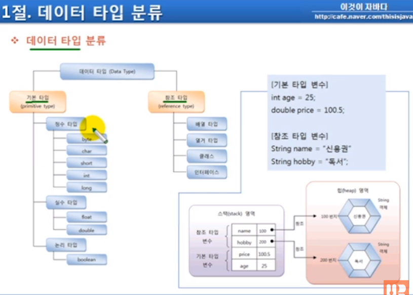

## 목차
[5.1 데이터 타입 분류](#51-데이터-타입-분류)   
[5.2 메모리 사용 영역](#52-메모리-사용-영역)   
    [- 메모리 사용 영역 실행 순서](#메모리-사용-영역-실행-순서)   
    [→ 1) JVM 구동 명령](#-1-jvm-구동-명령)   
    [→ 2) JVM 구동](#-2-jvm-구동)   
    [→ 3) MemoryExample(class)을 메모리에 로딩: 바이트 코드를 로딩](#-3-memoryexampleclass을-메모리에-로딩-바이트-코드를-로딩)   
    [→ 4) main 스레드 생성: main 메서드를 실행시키는 코드 흐름](#-4-main-스레드-생성-main-메서드를-실행시키는-코드-흐름)   
    [→ 5) main() 메서드 호출](#-5-main-메서드-호출)   
    [→ 6) main()의 매개변수가 String 배열 값으로 들어옴](#-6-main의-매개변수가-string-배열-값으로-들어옴)   
    [→ 7) int sum = 0; 생성](#-7-int-sum--0-생성)   
    [→ 8, 9) if 문 검증 후, int v2 = 10; 생성](#-8-9-if-문-검증-후-int-v2--10-생성)   
    [→ 10) add() 메소드 호출](#-10-add-메소드-호출)   
    [→ 11) 프레임 제거: 값이 return 되고 모든 실행이 끝나는 시점에서 add() 메서드에 의해 생성된 프레임이 제거됨](#-11-프레임-제거-값이-return-되고-모든-실행이-끝나는-시점에서-add-메서드에-의해-생성된-프레임이-제거됨)   
    [→ 12) main() 프레임의 sum 값 변화](#-12-main-프레임의-sum-값-변화)   
    [→ 13) main() 프레임의 v2, v3 값 제거](#-13-main-프레임의-v2-v3-값-제거)   
    [→ 14) 프로그램 종료](#-14-프로그램-종료)   
    [→ 15) JVM이 종료되면서 프로그램도 종료, Runtime Data Area도 없어짐](#-15-jvm이-종료되면서-프로그램도-종료-runtime-data-area도-없어짐)   
[- 더 알아보기](#더-알아보기)   
[5.3 참조 변수의 ==, != 연산](#53-참조-변수의---연산)   

## **5.1 데이터 타입 분류**



- 기본타입: 직접 값을 가지고 있음
- 참조타입: 객체를 참조하는 타입, 직접 값을 가지지 않고, 참조 객체의 번지를 가지고 있음
- int age = 25, double price = 100.5 에서 25, 100.5는 기본 타입으로, 직접 값이 스택 영역에 저장됨
- String name = “신용권”, “독서”는 힙 영역에 값을 저장한 객체가 생성되고, 이 번지가 스택 영역 변수에 저장됨 → 메모리 주소(번지)를 가지고 있다가, 필요할 주소로 때 객체를 이용
- 

### **메모리 사용 영역 실행 순서**

### **1) JVM 구동 명령**

```jsx
java (exe) MemoryExample
```

### **2) JVM 구동**

→ OS(운영체제)로부터 메모리를 할당받음(운영체제에서 받은 메모리 영역: Runtime Data Area)

→ Runtime Data Area 영역이 만들어지며 메소드 영역, 힙 영역 자동 생성

    .png)

### **3) MemoryExample(class)을 메모리에 로딩: 바이트 코드를 로딩**

→ 바이트 코드가 로딩되면, 메소드 영역에 클래스 내용이 올라감

    ⇒ 메소드 코드, 빌드 내용 등

    ⇒ 코드 자체가 올라가는 것이 아닌, 분석된 내용이 올라감

    ```java
    // 메소드 영역
    Class - MemoryExample.java
    [메소드 코드]
    public static void main(String[] args) {...}
    public static void add(int a, int b) {...}
    ```

    .png)

### **4) main 스레드 생성: main 메서드를 실행시키는 코드 흐름**

→ main 스레드 생성 동시에 JVM 스택 생성됨

    .png)

### **5) main() 메서드 호출**

→ JVM 스택에 main 메서드 호출하는 프레임 생성됨

    .png)

### **6) main()의 매개변수가 String 배열 값으로 들어옴**

```java
public static void main(String[] args) {
	// ....
}
```

→ 매개변수 args가 프레임 내부에 생성됨

    ⇒ 프레임 - main() 내부

    | 100 | args |
    | --- | --- |

    ⇒ 힙(Heap Area)

    | String[] 배열 (100번지) |
    | --- |

→ String 배열 객체는 heap 내부에 생성됨

    ⇒ 만약, 100번지에 String 배열 객체가 생성되었다면, args에는 100번지라는 주소값이 저장됨

    .png)

### **7) int sum = 0; 생성**

```java
public static void main(String[] args) {
	int sum = 0;
}
```

→ int sum = 0; 코드에 의해 메모리가 변형이 되는데, 변수기 때문에 프레임 내부에 생성이 됨

→ 즉, sum이라는 변수가 생성이 되며 0이라는 값이 저장됨 

    ⇒ 프레임 - main() 내부

    | 0 | sum |
    | --- | --- |
    | 100 | args |

    .png)

### **8, 9) if 문 검증 후, int v2 = 10; 생성**

```java
public static void main(String[] args) {
	int sum = 0;
	if (sum==0) {
		int v2 = 10;
		int v3 = 20;
	}
}
```

→ sum==0이면, int v2 = 10, int v3 = 20; 가 생성됨

    ⇒ 프레임 - main() 내부

    | 20 | v3 |
    | --- | --- |
    | 10 | v2 |
    | 0 | sum |
    | 100 | args |

    .png)

### **10) add() 메소드 호출**

```java
public static void main(String[] args) {
	int sum = 0;
	if (sum==0) {
		int v2 = 10;
		int v3 = 20;
		sum = add(v2, v3);
	}
}

public static int add(int a, int b) {
	return a + b;
}
```

→ 메소드를 호출했기 때문에 add() 프레임이 추가됨

→ add()의 파라미터 v2, v3는 add() 메서드의 a, b에 대입이 되게 됨

→ 메모리에 a, b 변수와 각각 10, 20 값이 저장됨

    ⇒ 프레임 - add()

    | 20 | b |
    | --- | --- |
    | 10 | a |

    ⇒ 프레임 - main()

    | 20 | v3 |
    | --- | --- |
    | 10 | v2 |
    | 0 | sum |
    | 100 | args |

    .png)

### **11) 프레임 제거:** 값이 return 되고 모든 실행이 끝나는 시점에서 add() 메서드에 의해 생성된 프레임이 제거됨

```java
public static void main(String[] args) {
	int sum = 0;
	if (sum==0) {
		int v2 = 10;
		int v3 = 20;
		sum = add(v2, v3);
	}
}

public static int add(int a, int b) {
	return a + b;
} //-------(메소드 끝나는 시점)
```

.png)

### **12) main() 프레임의 sum 값 변화**

→ add() 메서드가 리턴한 값 30이 sum에 저장이 되며, main() 프레임의 sum의 값이 30으로 변함

    ⇒ 프레임 - main()

    | 20 | v3 |
    | --- | --- |
    | 10 | v2 |
    | 30 | sum |
    | 100 | args |

    .png)

### **13) main() 프레임의 v2, v3 값 제거**

→ if 문이 끝나는 시점에서 v2, v3는 메모리에서 제거됨

    ⇒ 프레임 - main()

    | 30 | sum |
    | --- | --- |
    | 100 | args |

    ```java
    public static void main(String[] args) {
        int sum = 0;
        if (sum==0) {
            int v2 = 10;
            int v3 = 20;
            sum = add(v2, v3);
        } //----(if 끝나는 시점)
    }
    ```

    .png)

### 14) 프로그램 종료

→ System.out.println(sum)으로 sum 의 값 출력 후 

    ```java
    public static void main(String[] args) {
        int sum = 0;
        if (sum==0) {
            int v2 = 10;
            int v3 = 20;
            sum = add(v2, v3);
        }
        System.out.println(sum);
    } //-----(main 메서드 끝나는 시점)
    ```

    ⇒ main() 메서드 종료 시점에서

    ⇒ int sum = 0; 으로 선언했던 변수 메모리에서 삭제됨

    ⇒ 매개변수인 String[] args도 삭제됨

    .png)

    ⇒ main()이 끝나게 되면 main() 프레임이 사라짐

    .png)

### **15) JVM이 종료되면서 프로그램도 종료, Runtime Data Area도 없어짐**

.png)

### 더 알아보기

.png)

전체

.png)

기본 타입 변수

1. 스택에 v1라는 변수가 생성이 되며, A에 유니코드가 저장됨
2. 스택 영역에 v2가 생성, 100 값 저장, v3 이하동일
    
    if 가 끝나는 시점에서 v2, v3 변수 제거됨
    
3. 스택에 v4 변수 생성, true 값 저장
- 기본 타입 변수는 직접 값을 가지고 있음

.png)

참조 타입 변수 - 배열

- 10, 20, 30 값을 가진 배열 객체를 scores 변수가 “참조한다”고 해석
- scores 변수는 스택 영역에 생성, 배열 값은 힙 영역에 생성
- 힙 영역에 생성된 배열 객체의 번지를 스택의 scores에 저장
- 번지 참조 변수: 배열 타입 변수는 직접 값을 가지는 것이 아닌, 배열 객체가 생성된 번지를 가짐

.png)

참조 타입 변수 - 문자열

- 위 String은 클래스 타입이며, 참조 변수
- 객체 생성 연산자인 new를 이용해 String 객체 생성
- name 변수는 String 객체의 번지를 가지고 있음
- 힙 영역에 생성된, 문자열을 가진 String 객체의 번지수를 스택 영역의 name 변수에 저장
- 힙 영역에 생성된 String 객체의 번지가 100이라면, 스택 영역의 name에는 100을 저장함
- new 연산자를 사용하지 않고 문자열 리터럴을 사용해서 아래와 같이 생성했을 때도, 힙 영역에 해당 문자열에 대한 객체가 생성되고, 그 객체의 번지가 스택 영역의 변수에 저장됨
    
    ```java
    String name3 = "name";
    ```

## **5.3 참조 변수의 ==, != 연산**