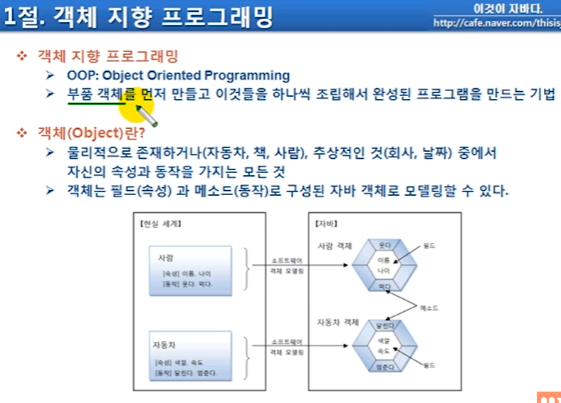

## 목차
[6.1 객체 지향 프로그래밍](#61-객체-지향-프로그래밍)   
[6.2 객체와 클래스](#62-객체와-클래스)   
[6.3 클래스 선언](#63-클래스-선언)   
[6.4 객체 생성과 클래스 변수](#64-객체-생성과-클래스-변수)   
[6.5 클래스의 구성 멤버](#65-클래스의-구성-멤버)   
[6.6 필드](#66-필드)   
[6.7 생성자(1)](#67-생성자1)   
[6.7 생성자(2)](#67-생성자2)   
[6.8 메소드(1)](#68-메소드1)   
[6.8 메소드(2)](#68-메소드2)   
[6.8 메소드(3)](#68-메소드3)   
[6.9 인스턴스 멤버와 this](#69-인스턴스-멤버와-this)   
[6.10 정적 멤버와 static(1)](#610-정적-멤버와-static1)   
[6.10 정적 멤버와 static(2)](#610-정적-멤버와-static2)   
[6.11 final 필드와 상수](#611-final-필드와-상수)   
[6.12 패키지(1)](#612-패키지1)   
    [→ 패키지 폴더 내 만들어진 class 파일 확인하기](#패키지-폴더-내-만들어진-class-파일-확인하기)   
    [→ -d 옵션으로 패키지 선언된 java파일 컴파일 후 class 파일 실행하기](#d-옵션으로-패키지-선언된-java파일-컴파일-후-class-파일-실행하기)   
[6.12 패키지(2)](#612-패키지2)   
[6.13 접근 제한자](#613-접근-제한자)   
[6.14 Getter와 Setter 메소드](#614-getter와-setter-메소드)   
[6.15 어노테이션(1)](#615-어노테이션1)   
[6.15 어노테이션(2)](#615-어노테이션2)   

## **6.1 객체 지향 프로그래밍**

- 자바로 객체 지향 프로그래밍을 작성하기 위해서는 클래스부터 선언해야 함



- 객체지향 프로그래밍: 자동차를 만들 때, 타이어 객체, 엔진 객체, 문 객체, 핸들 객체를 합쳐 만드는 것처럼, 각 부품 객체들을 조립해 완성된 프로그램을 만드는 것
- 객체: 속성과 동작을 가지는 모든 것
- 자바 객체: 필드(속성), 메서드(동작)으로 구성됨
- 객체 모델링: 현실 세계를 소프트웨어 객체로 변환하는 것

.png)

.png)

- 집합 관계: “어떤 부품들이 모여 완성품이 만들어진다”
    - 엔진 객체, 타이어 객체, 핸들 객체 → 자동차 객체
- 사용 관계: “어떤 객체가 어떤 객체의 메서드를 호출해서 사용한다”
    - 사람이 → 자동차를 사용
- 상속 관계: “어떤 객체가 어떤 객체의 내용을 물려받아서 사용한다”
    - 자동차 객체는 → 기계 객체의 데이터(속성, 동작)을 사용할 수 있음

.png)

- 실제 필드와 메서드를 외부로부터 보이지 않게 구조를 숨김
- 몇 가지 필드와 메서드만 외부에 제공

.png)

.png)

- 객체의 부품화: 그때그때 객체를 바꿔 끼워 사용할 수 있음
- 다형성: 설계할 때 타입은 ‘타이어’로 모두 동일하지만, 실제 구현 객체는 ‘타이어의 하위 객체’인 한국 타이어, 금호 타이어로, 실행 결과가 다양하게 나올 수 있음

## **6.2 객체와 클래스**

.png)

## **6.3 클래스 선언**

.png)

.png)

- 2개 이상의 Class가 선언된 소스 파일을 컴파일 하면, 선언된 Class 개수만큼 바이트 코드 파일 생성됨
- 하나의 소스 파일은 Class들을 담고 있는 그릇 역할만 하고, 컴파일 되어 나오는 바이트 코드 파일의 수는 Class의 수가 결정함

## **6.4 객체 생성과 클래스 변수**

.png)

- new 연산자로 생성된 클래스 객체는 힙 영역에 위치
- new 연산자는 힙 영역에 생성된 객체의 번지를 리턴하고, 이 번지가 스택 영역에 선언된 클래스 변수에 저장됨

.png)

- 클래스 용도
    - 1) 라이브러리
        - 클래스를 작성할 때, main() 메서드를 넣지 않고 필드, 생성자, 메서드 내용으로만 클래스를 작성하게 되면 그 클래스는 실행할 수 없는 클래스가 됨
        - 라이브러리용 클래스는 반드시 객체를 생성한 후 사용해야 함(정적 필드, 정적 메서드 제외)
        - 예) Student 객체
    - 2) 실행용: main()

## **6.5 클래스의 구성 멤버**

.png)

- 생성자
    - 객체 생성. 초기화 담당. `실행 블록({})`을 가짐.
    - `new 생성자();` 로 생성자를 호출하므로, 이때 생성자의 `{}`이 실행되고, 블록이 끝나는 시점에서 객체가 완성됨.
    - 리턴 타입이 없음
- 메서드: void 외 리턴 타입을 반드시 지정해야 함

## **6.6 필드**

.png)

.png)

.png)

.png)

## **6.7 생성자(1)**

.png)

.png)

.png)

.png)

.png)

## **6.7 생성자(2)**

.png)

.png)

생성자 코드 중복의 예시

.png)

- 중복 코드를 피하는 방법: this() 사용
- this(): 객체의 다른 생성자를 지칭, 즉 자신의 다른 생성자를 지칭

```java
Car(String model, String color, int maxSpeed) {
	this.model = model;
	this.color = color;
	this.maxSpeed = maxSpeed;
}
// (1) 공통 실행 코드를 작성해 놓고, this()로 이 코드를 호출함

Car(String model) { // (2)
	this(model, null, 0); // 생성자를 호출만 함(매개변수 외의 값은 기본값)
// 즉, (2)는내부적으로 (1)에 선언한 생성자를 실행하는 것
}
```

- this()는 생성자의 가장 첫 줄에 작성되어야 함

```java
// 올바른 예
Car(String model) {
	this(model, null, 0);
	System.out.println();
}
```

```java
// 올바르지 않은 예
Car(String model) {
	System.out.println();
	this(model, null, 0);
}
```

## **6.8 메소드(1)**

.png)

.png)

.png)

.png)

## **6.8 메소드(2)**

.png)

.png)

## **6.8 메소드(3)**

.png)

.png)

.png)

- method1()을 double타입으로 받으면 double로 자동 타입 전환됨

.png)

.png)

## **6.9 인스턴스 멤버와 this**

.png)
- int gas, setSpeed() 코드가 Car 객체 안에 들어갈까? ⇒ No
    - Car 객체 안에 gas 필드를 저장하는 공간이 생기고, setSpeed()를 호출할 수 있다는 뜻이지, 메서드 코드가 객체 안에 들어가지는 않음
    - 메서드 코드는 메서드 영역에 위치함(메서드 호출은 객체를 통해 함)

.png)

- this는 heap 객체 내부에 생성됨
- this는 객체 내부에서 자신의 위치 정보 값을 저장하고 있음
- this.field: 객체가 가지고 있는 필드

## **6.10 정적 멤버와 static(1)**

.png)

- 인스턴스 멤버: 객체에 소속
- 정적 멤버
    - 클래스에 소속
    - 객체 내부에 존재하지 않음, 메소드 영역(클래스의 바이트 코드가 있는)에 존재함
    - 객체 안에 존재하지 않기에, 객체를 만들지 않아도 됨
    - 클래스만 가지고도 정적 멤버 사용 가능
- static이 있으면 정적 멤버, 없으면 인스턴스 멤버
- static이 붙게 되면, 이 클래스를 JVM에 속해있는 클래스 로더가 컴파일된 바이트 코드를 읽어 메소드 영역에 적재시킴
- 이때, 바이트 코드의 내용을 분석해서 정적 필드, 정적 메소드를 메소드 영역에 위치시킴
- 정적 필드와 정적 메서드는 객체를 만들 때 그 안에 들어가는 것이 아니라, 메서드 영역에 위치하며, 정적 필드에 데이터가 저장되기도 하며, 정적 메서드가 실행되기도 함
- 즉, 정적 필드와 정적 메서드는 객체 안에 저장되지 않고, 메서드 영역 한 곳에만 고정되어 있음

.png)

- 인스턴스 멤버를 new 연산자로 접근하는 것과는 달리, 정적 멤버는 클래스 이름과 도트 연산자로 접근
- 예를 들어, Calculator의 static double pi, static int plus, static int minus는 정적 멤버이므로 만들어진 객체마다 가지는 것이 아니라,  클래스 바이트 코드와 함께 메서드 영역의 고정된 위치에 저장됨
- static 키워드는 공통적인 의미를 가지고 있고, 객체마다 공유해서 쓸 수 있음

.png)

- 메서드 영역에 있는 정적 멤버들을 힙 영역의 객체들을 통해 사용할 수 있음
- 원래는 클래스 이름을 통해서 접근해야 하지만, 객체들을 통해서도 접근할 수도 있다는 말
- 하지만, 어디서나 가능하다는 얘기지 클래스가 아닌 객체를 통해 정적 멤버에 접근하는 것은 바람직하지 않음- 
- **[바른 사용]: 메서드 영역의 Calculator클래스 에서 바로 pi, plus, minus 사용하기**

.png)

.png)

- static int x = 10; static String company = “삼성”; 과 같이 단순하지 않은 복잡한 초기화 식은 정적 초기화 블록 안에서 실행

```java
class Test {
	int x = 10;
	int y;
	Test() {
		y = 20; // 생성자 내에서 복잡한 필드값을 줄 때
	}
	// static 필드는 생성자 내에서 초기화 할 수 없음
	// 생성자는 객체를 생성할 때 실행하므로 객체와 관련있음 
	// static은 객체 안에 들어가는 게 아니기 때문에 생성자 안에서 초기화하지 못함
}
```

- static은 객체 안에 들어가는 게 아니기 때문에 생성자 안에서 초기화하지 못함 ⇒ 생성자는 객체를 생성할 때 실행되는 것이므로

```java
class Test {
	static int x;
	static {
		x = 10; // 이런 식으로 static 필드 초기화 가능(for문 등도 가능)
	}
	// 정적 필드 초기화, 정적 메서드 호출 가능
	// 인스턴스 필드, 인스턴스 메서드 호출 불가능
}
```

- static 블록은 클래스가 메모리로 로딩될 때, 즉 메서드 영역으로 들어올 때 자동으로 실행됨
    - 정적 필드 초기화, 정적 메서드 호출 가능
    - 인스턴스 필드, 인스턴스 메서드 호출 불가능

.png)

- 여러 개의 static 블록 선언 가능(순차적으로 실행)

## **6.10 정적 멤버와 static(2)**

.png)

- static 블록에서는 인스턴스 멤버를 사용할 수 없음
- 그래서, 위 예시처럼 field1, method1()을 static에 넣을 수 없음
- 마찬가지로, 객체 자신을 참조하는 this도 사용할 수 없음

.png)

- 객체를 생성한 후에는 사용할 수 있음 ⇒ obj가 참조하는 객체
- 즉, static void Method() 처럼 객체를 만들고 인스턴스 필드를 사용하는 것은 가능

.png)

- main() 메서드도 정적 메서드
- 객체가 있어야 그 안의 인스턴스 멤버를 사용할 수 있으므로, 위의 예시처럼 main() 메서드에 Car 객체를 생성해서 사용함

.png)

- 단 하나의 객체를 만들어야 하는 경우, new로 객체를 만들지 못하도록 함
    1. private 접근 제한자를 생성자 앞에 붙임
    2. private 접근 제한자를 필드값 앞에 붙임
    3. 정적 메서드 getInstance() 선언
        1. getInstance()는 자기 자신의 객체 리턴
        2. 자기 자신의 필드에 대입된 객체, 즉 필드가 참조하는 객체를 리턴
        3. getInstance() 메서드가 몇 번을 실행되던 자기 자신의 필드에 대입된 단 하나의 new 객체만 리턴함
- 즉, 외부에서는 싱글톤 객체를 new 연산자를 통해 호출할 수 없음
- 반드시 getInstance()를 통해서만 호출 가능
- getInstance() 메서드는 자기 자신 필드가 참조하는 항상 하나의 객체만 리턴함

.png)

<aside>
💡 **내용정리!**

> 메서드 영역의 Singleton 필드가 → 힙 영역에 만들어진 객체 new Singleton()을 참조하고,   
> 스택 영역에 만들어진 Singleton obj1 변수가 → 힙 영역의 유일한 객체 new Singleton()을 참조하는 듯   
> 그런데 Singleton 필드는 private이라 외부에서 불러올 수 없으니,   
> static getInstance() 메서드를 만들어서 외부에서 이것만 호출할 수 있도록 하는 듯   
</aside>

- 싱글톤 객체의 getInstance() 메서드는 static이기 때문에 클래스로 접근 가능
- private 때문에 외부에서 접근할 수 없기 때문에, `Singleton obj1 = new Singleton();` 과 같은 코드는 오류가 남
- **애플리케이션 전체에서 싱글톤 객체는 딱 하나만 만들어짐**
- [싱글톤에 대한 더 자세한 설명](https://roadofdevelopment.tistory.com/19)

## **6.11 final 필드와 상수**

.png)

- `final String ssn;` 와 같이 변수 선언 후 나중에 값을 줄 경우, 생성자로만 딱 한번의 초기값을 지정할 수 있음
- 생성자로 `this.ssn = ssn;` 으로 값을 한번 대입시킨 후에는 값을 변경할 수 없음

.png)

- final 필드: 객체마다 가지는 불변 필드
- 상수
    - 객체마다 가지고 있는 게 아니고, 메서드 영역의 상수 area에 저장됨
    - 보통 대문자로 변수 선언
    - 선언과 동시에 초기값을 주거나, `static final 타입 상수;`와 같이 변수만 선언 후 static 블록에 딱 한 번 초기값 설정 가능

## **6.12 패키지(1)**

.png)

- 클래스 관리를 위해 만들어진 체계

.png)

.png)

- 패키지가 없는 자바 소스 파일을 `컴파일` 할 경우
    
    ```bash
    $ javac xxx.java
    ```
    
    - .class 파일만 생성, 패키지에 해당하는 폴더는 자동으로 만들어지지 않음
    - 이 경우, 패키지를 적용하려면 패키지 폴더를 직접 만들어 바이트 코드 파일 저장 후 사용
- 패키지가 있는 자바 소스 파일을 `컴파일` 할 경우
    
    ```bash
    $ javac -d [패키지 생성 위치] xxx.java
    ```
    
    - 패키지 폴더 자동 생성됨
- 패키지 선언이 포함된 Application `클래스 실행`
    
    ```bash
    $ java Application(.class) // 오류 - 패키지 경로가 포함되어 있지 않음
    $ java sec12.exam01_package_compile.Application // 패키지 경로 포함해야 함
    ```
    

### 패키지 폴더 내 만들어진 class 파일 확인하기

.png)

- show view - Navigator 추가 후 class 파일이 만들어지는 bin 폴더 확인
- 패키지 선언이 되어 있으나, 다른 폴더에 임의로 class 파일을 넣고 java classfile 명령어로 실행하면 오류 발생함
    
    .png)
    
    sec12.exam01_package_compile 패키지가 아닌 Temp 폴더에서 실행해서 오류 발생
    
- 하지만, sec12/exam01_package_compile 폴더로 가서 class 파일을 실행해도 오류 발생함
    
    .png)
    
    ⇒ class 파일 내 패키지 선언이 되어있기 때문에, 상위 패키지인 sec12의 상위 폴더인 Temp 폴더에서 `java 명령어 + 패키지 포함` 명령어로 실행해 줘야 함
    
    .png)
    
    - 전체 클래스 = 패키지 포함
    - java + 전체클래스 명령어로 실행해 줘야 정상적으로 실행됨
    - 패키지 이름도 클래스 이름에 포함되기 때문

### -d 옵션으로 패키지 선언된 java파일 컴파일 후 class 파일 실행하기

1. 컴파일하기
    
    ```bash
    $ javac -d . Application.java
    // -d : 현재 위치에 패키지를 생성해라
    ```
    
    .png)
    
    .png)
    
    Temp 폴더 내에서 컴파일 했으므로 여기 sec12.exam01 패키지가 생성되고, 그 안에 class 파일이 생성됨
    
2. 실행하기
    
    ```bash
    $ java sec12.exam01_package_compile.Application
    ```
    
    .png)
    

## **6.12 패키지(2)**

.png)

- 어떤 패키지에 있는 클래스를 사용할 건지 클래스 상단에 import로 명시해 줘야 함
- 같은 패키지 내 클래스는 클래스 이름 만으로 사용 가능
- 다른 패키지 내 클래스를 사용하려면 컴파일러에게 import로 클래스 위치 알려줌
- 다른 패키지 내 클래스 사용 방법
    1. 패키지 명을 포함한 전체 클래스 이름 사용
        
        ```java
        public class Car {
        	com.hankook.Tire tire = new com.hankook.Tire();
        }
        ```
        
    2. 어떤 패키지를 사용할 건지 import로 미리 선언
        
        ```java
        import com.hankook.Tire; // com.hankook 패키지 내 Tire 클래스만 사용
        import com.hankook.*; // com.hankook 패키지 내 모든 요소 사용
        ```
        
- 패키지 내 클래스 하나하나가 아닌, *로 모든 클래스를 한꺼번에 적용하려면 이클립스 설정을 바꾸면 됨
- 다른 패키지에 이름이 동일한 클래스가 2개 이상 있는 경우 ⇒ 패키지 포함 클래스명 사용
    
    .png)
    
    이름이 동일한 2개 이상의 클래스 Tier
    
    .png)
    
    패키지 포함 클래스명 사용, Tier 클래스 포함된 import는 삭제
    

## **6.13 접근 제한자**

.png)

- 클래스 구성 멤버: 필드, 생성자, 메서드
- protected: 상속과 관련
- default: 접근 제한자를 붙이지 않은 모든 요소에 적용

.png)

- default 클래스 A, B는 외부 패키지의 C에 선언될 수 없음
- public 클래스 A, B는 외부 패키지의 C에 선언될 수 있음

.png)

- 접근제한자에 따라 `new 생성자();` 의 생성 가능 유무가 달라짐
- public: 어디서든 `new 생성자();` 로 생성 가능
- default: 같은 패키지 내에서만 `new 생성자();` 로 생성 가능
- private: 생성자 내부 클래스 제외 외부 클래스에서 `new 생성자();` 생성 불가능

.png)

- a1는 public이라 외부 클래스 C에서 생성 가능, a2는 private라 생성 불가능

.png)

- 같은 클래스 A 내부에서는 field1, 2, 3, method1(), 2(), 3() 모두 사용 가능

.png)

- 같은 패키지 내 클래스 A, B: 외부 블래스 B에서 default인 `a.field3` 사용 가능, private인 `a.method3()` 사용 불가

.png)

- 다른 패키지 내 클래스 A, C: 외부 클래스 C에서 default인 `a.field3` 사용 불가, private인 `method2(), 3()` 사용 불가

- 다른 패키지 내 클래스 A, C: 외부 클래스 C에서 default인 `a.field3` 사용 불가, private인 `method2(), 3()` 사용 불가

## 6.14 Getter와 Setter 메소드

.png)

- **Getter**: private 필드를 <b>`읽기 전용`</b>으로 접근하기 위함
    
    ⇒ private 필드는 외부에서 변경하거나, 읽지 못하게 하는데, getter로 읽기 전용으로 외부에 보내줄 수 있음
    
    ⇒  데이터 연산을 하거나, 중요한 값을 일부 숨기고, 필드 값을 가공해서 return 하기도 함
    
- **Setter**: 외부에서 대입 되는 값을 <b>`검사`</b>할 수 있음
    
    ⇒ 외부에서 필드 값을 간접적으로 값을 저장할 수 있게 해 줌, 유효성 검사를 해서 엉뚱한 값으로 변경할 수 없도록 함
    

.png)

- 자동으로 getter, setter 만들기: source - generate getters and setters

## **6.15 어노테이션(1)**

.png)

- 작성된 코드가 잘못되었는지 체크할 수 있도록 컴파일러에게 정보 제공
- 컴파일러에게 무언가를 지시
- 빌드, 배치 시 코드를 자동으로 생성하도록 함(jar, war 등 특정 확장명으로 압축하도록 개발 툴에게 지시할 수 있음)
- 실행 시 특정 기능을 실행하도록 지시
- java5 부터 사용 가능

.png)

- 어노테이션의 엘리먼트 멤버: 어노테이션의 내용
    
    즉, 외부의 값(개발자가 입력한 값)을 입력받을 수 있도록 하는 역할
    
- 예1) 해당 클래스가 컨트롤러 역할을 하도록 @Controller 적용, 이때, 참조 이름으로 main이라는 이름을 줌 ⇒ 이 클래스는 main이라는 이름을 가짐

.png)

- 예2) `@Annotation(”값”)`과 같이 인자가 단일 값일 경우, 엘리먼트 멤버 내 기본 엘리먼트인 `String value();`에 대입이 됨
- 예3) 두 개 이상의 인자가 있을 경우, `@Annotation(value=”값”, element=”값2”)`로 작성

.png)

- 어노테이션을 적용할 때, 어노테이션 적용 대상을 명시해야 함
    
    ⇒ “코드 상에서 어떤 선언에 어노테이션을 적용할 수 있는가?”
    
- @Target({})으로 선언, 인자로는 배열이 들어감
- 예시)
    
    ```java
    @Target({ElementType.TYPE, ElementType.FIELD, ElementType.METHOD})
    public @interface AnnotationName {
    }
    ```
    
    ⇒ 위 어노테이션은 아래 클래스에 이렇게 사용될 수 있음
    
    ```java
    @AnnotationName
    public class ClassName {
    	@AnnotationName
    	private String fieldName;
    
    	// @AnnotationName (x) // @Target의 인자에 ElementType.CONSTRUCTOR가 없으므로 생성자에는 어노테이션 적용 불가
    	public ClassName() {}
    
    	@AnnotationName
    	public void methodName() {}
    }
    ```
    
    ⇒ @Target의 인자인 타입, 필드, 메서드에만 어노테이션 적용 가능
    

.png)

- 어노테이션 적용 코드: `@AnnotationName()`
- @Retention(): 어노테이션을 적용한 코드가 언제까지 유지될 것인지 지정
    - @Retention(RetentionPolicy.SOURCE):
        - 개발자가 소스를 읽을 때만 어노테이션 사용
        - 컴파일러가 컴파일을 거쳐 바이트 코드(.class)를 만든 후에는 어노테이션 내용을 바이트 코드에서 뺌
        - 사람이 소스에서 정보를 얻을 목적으로 사용하는 정책
    - @Retention(RetentionPolicy.CLASS):
        - 바이트 코드 까지는 어노테이션이 남아 있음
        - 클래스를 실행시킬 때, 어노테이션의 값(어노테이션의 엘리먼트 값)을 얻을 수 없음
        - 클래스 상에만 존재, 실제 실행할 때는 그 정보를 읽지 못하는 정책
    - @Retention(RetentionPolicy.RUNTIME):
        - 바이트 코드까지 어노테이션 유지
        - 바이트 코드 파일 메모리 로딩 후 실제 프로그램이 실행할 때,  어노테이션 정보를 읽고 이용할 수 있는 정책
        - ***대부분 이 정책을 사용**
- **리플렉션**: 프로그램 실행 중에 클래스의 메타정보(클래스 이름, 필드, 필드 개수, 종류, 타입, 생성자의 개수, 생성자의 매개변수 등)를 동적으로 얻어내는 기능
- **런타임**: 실행 시
- @Retention(RetentionPolicy.RUNTIME)의 RetentionPolicy.RUNTIME은 기본 인자(value)

<aside>
💡 **내용정리!**   
> - @Annotation에 붙여주는 Annotaion   
> → @Target: 이 어노테이션을 코드 어디에 적용할 것인가?   
> → @Retention : 이 어노테이션을 어디까지 사용할 것인가?   
</aside>

## **6.15 어노테이션(2)**