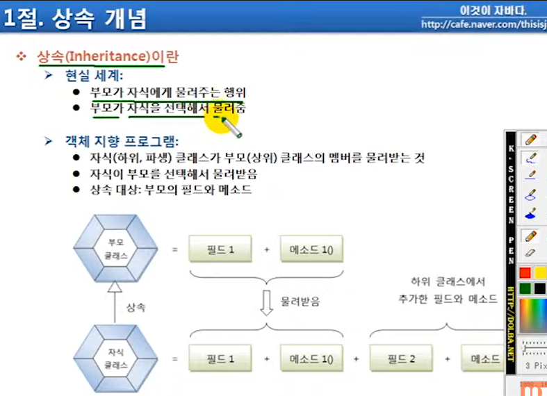

## 목차
[7.1 상속 개념](#71-상속-개념)   
[7.2 클래스 상속](#72-클래스-상속)   
[7.3 부모 생성자 호출](#73-부모-생성자-호출)   
[7.4 메소드 재정의](#74-메소드-재정의)   
[7.5 final 클래스와 final 메소드](#75-final-클래스와-final-메소드)   

## **7.1 상속 개념**



- 현실: 부모가 자식 선택, 상속해 줌
- 객체 지향 프로그램: 자식이 부모 선택, 상속 받음

.png)

.png)

- 패키지가 다를 경우, package2에 있는 자식 클래스는 package2에 있는 부모 클래스가 가진 `default` 필드와 메서드를 상속 받지 못함

## **7.2 클래스 상속**

.png)

## **7.3 부모 생성자 호출**

.png)

- 자식 클래스로부터 자식 객체를 생성할 때: 부모 객체 생성 → 자식 객체 생성
    
    ```java
    public DmbCellPhone () { // 자식 객체가 생성될 때,
    	super(); // 컴파일러가 자동으로 넣은 super()가 먼저 부모의 기본 생성자를 호출
    } // 자식 생성자 생성
    ```
    
- dmbCellPhone 변수는 자식 객체를 참조함

.png)

- 자식 생성자 안에 super()라는 부모 생성자를 선언하지 않아도 컴파일러가 자동으로 추가
- 자식 생성자 안에서 부모 생성자의 기본 생성자를 호출해서 부모 객체 생성 → 그 후 자식 객체 생성
- 개발자가 직접 super를 작성하고 매개값을 추가할 수도 있음
- 부모 클래스에 매개변수 없는 기본 생성자가 없다면 자식 클래스에 super() 선언 해줘야 함

## **7.4 메소드 재정의**

.png)

- 메서드 재정의 = 오버라이드
- @Override: 코드가 제대로 작성했는지 검사하는 어노테이션

.png)

- 재정의된 method2()는 부모 클래스가 아닌 자식 클래스의 메서드를 가리킴
- override 단축기: ctrl + space

.png)

- 부모 메서드를 호출해서 사용하는 경우 ⇒ super 키워드 사용
- super: 부모 객체의 참조(자기 자신 객체의 참조 this와 비슷)
- 메서드 재정의:
    - 앞에 아무것도 안 붙은 경우: 자식 클래스의 메서드
    - 앞에 super가 붙은 경우: 부모 클래스의 메서드

## **7.5 final 클래스와 final 메소드**