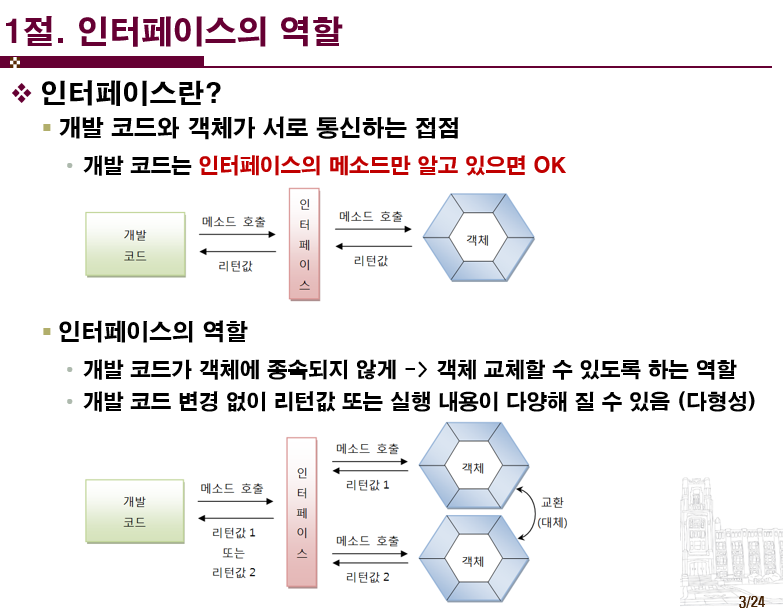

## 목차
[8.1 인터페이스의 역할](#81-인터페이스의-역할)   
[8.2 인터페이스 선언](#82-인터페이스-선언)   
[8.3 인터페이스 구현(1)](#83-인터페이스-구현1)   
[8.3 인터페이스 구현(2)](#83-인터페이스-구현2)   

## **8.1 인터페이스의 역할**

- 개발 코드가 어떤 객체를 이용해 메서드를 호출하려고 한다
    
    → 개발 코드가 객체를 직접 이용하는 게 아니라, 중간에 인터페이스를 둠
    
    → 인터페이스가 객체의 메서드를 호출하고, 리턴값을 넘겨줌
    
    → 개발 코드는 인터페이스를 통해 메서드 호출하고, 값을 리턴받음
    
- 개발 코드는 뒤편에 있는 객체가 어떤 객체인지 상관할 필요가 없음
- 그러므로, 객체에 문제가 있을 경우 이것만 다른 객체로 변경할 수 있고, 인터페이스만 바라보는 개발 코드는 문제 없음
- 인터페이스의 역할: 개발 코드를 수정하지 않고, 내부에 실제 사용되는 객체를 쉽게 이용하거나 변경할 수 있도록 도와줌

## **8.2 인터페이스 선언**

.png)

- 자바의 상수: static final 타입 상수명
- 인터페이스의 모든 필드는 static final 특성을 가지고 있음 ⇒ 앞에 static final을 붙이지 않아도 기본적으로 상수 특성을 받음
- 상수 초기값 필수
- 인터페이스의 메서드도 선언만 있고 실행 블록은 없음 ⇒ 기본적으로 abstract 메서드로 해석됨
- default, static 메서드: 자바 8부터 추가
    - default 메서드: 메서드 실행 블록이 있음, 인터페이스에서 정의된 메서드지만 실행하려면 인터페이스 구현 객체가 필요
    - static 메서드: 메서드 실행 블록이 있음, 인터페이스를 통해 바로 호출 가능

.png)

- 데이터를 저장하지 않기 때문에: 실행 중 데이터를 저장하지 않음
- static {}과 같은 정적 블록을 작성할 수 없음
- 때문에, 상수(필드)값은 선언과 동시에 초기화 필수

.png)

- 개발 코드 → 인터페이스로 메서드 호출
    
    → 인터페이스는 자기가 참조하는 객체로 가서 인터페이스의 메서드를 재정의한 메서드를 실행시킴
    
    → 인터페이스는 객체에서 리턴값을 받아 개발코드로 리턴
    
- 인터페이스 내 추상메서드는 `어떻게 호출한 것인가`에 대한 방법만 제시함 ⇒ 실제 실행되는 코드는 객체가 가진 재정의된 메서드

.png)

- default 메서드: 실행 블록을 가지는 인터페이스 메서드

.png)

- 기본적으로 public 접근 제한이므로 생략하더라도 컴파일 과정에서 붙음

## **8.3 인터페이스 구현(1)**

.png)

- 인터페이스 만으로는 실제 동작하는 프로그램을 만들 수 없음
- 인터페이스를 통해서 객체를 사용해야 하기 때문에, 객체가 있어야 함 ⇒ **인터페이스의 구현 객체**
- 인터페이스의 구현 객체: 인터페이스의 추상메서드를 실제적으로 재정의한 객체
- 구현 클래스: 인터페이스의 구현 객체를 생성하는 클래스
- 과정: 구현 클래스 생성 → 구현 객체 생성 → 이 객체를 인터페이스에 대입 → 개발 코드에서 인터페이스를 사용해 객체의 재정의된 메서드 호출, 리턴 값 받음

.png)

- 위의 예시 코드에서처럼, RemoteControl 인터페이스에는 3개의 메서드가 정의되어 있는데, Television에는 그 일부인 2개의 메서드만 재정의 되었다면, Television 클래스는 `추상클래스`임(abstract)
    
    .png)
    
    ⇒ 재정의되지 않은 RemoteControl의 setVolume() 메서드는 `추상 메서드`임
    
- 인터페이스의 모든 메서드는 public 접근 제한을 가짐

.png)

- 인터페이스도 하나의 타입이기 때문에, 인터페이스를 선언 후 간접적으로 구현 객체를 대입해 이용 가능
- 인터페이스를 구현한(implements) 어떤 구현 객체라도 인터페이스에 대입해 이용 가능- 

## **8.3 인터페이스 구현(2)**

## 참고자료

[강의교안_8장.ppt](./images/강의교안_8장.ppt)